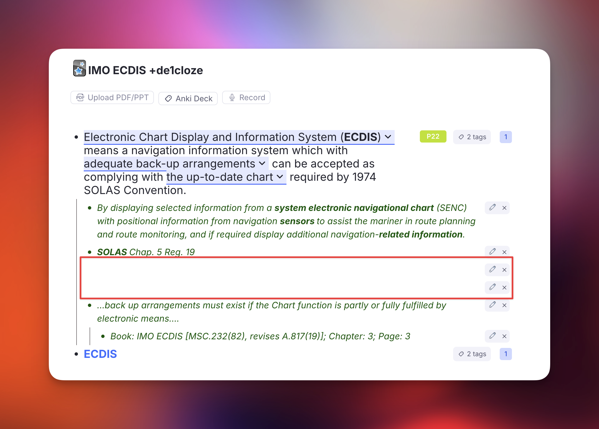

# Cleaning Up

Commands that clear out Rems an import left behind, and find flashcards that cannot be practised.

## Delete Empty Extra Card Detail Rems

**`Delete Empty Extra Card Detail Rems`** (`quick: decd`) finds Rems tagged **Extra Card Detail** that hold *nothing at all*, and deletes them once you have confirmed the count.

### Why they exist

They come from **Anki imports**. Anki's *Extra* / *Back Extra* field is HTML, where a paragraph break is a structural element rather than a character. An importer that maps that field onto RemNote's **Extra Card Detail** powerup therefore creates a child Rem for every ` ` and `
` — and the ones carrying no text arrive as Rems holding literally nothing.

In the outline they are easy to miss — a pair of blank bullets among the green ECD ones, betrayed only by the `✎ ✕` controls sitting on otherwise empty rows:

{ width="800" }

In the **queue** they are not missable, because every item shown has to be named and these have no name — so each one surfaces as **Unnamed** while you review.

### Why the normal search cannot find them

RemNote's search indexes **text**, and these Rems have none. Neither `Ctrl+F` nor a query can isolate a Rem by its emptiness.

Asking the **Extra Card Detail** powerup for its members does not work either — RemNote does not expose membership for its *built-in* powerups, so that list comes back nearly empty on a knowledge base full of them. (The same limitation shows up elsewhere in this plugin, with PDF Highlights and uploaded files.)

So the command works by **walking the scope and asking each Rem directly** whether it carries the powerup. That sounds expensive and is not, because of the order it works in: whether a Rem is blank is readable without asking RemNote anything, so the blank test runs first and reduces a whole knowledge base to the few Rems worth a question.

### How to use it

Run it from the omnibar. Two scopes, as with the image scan:

* **This Rem and its descendants** — the focused Rem, or the open document when the cursor is not in a Rem.
* **The whole knowledge base** — every Extra Card Detail Rem there is.

**The scan writes nothing.** It reports what it found and waits; nothing is deleted until you press the red button.

### What counts as empty

The bar is set high on purpose, because this command *deletes*.

!!! warning "Blank text is not the same as empty"
    Some Rems hold **no text at all and are still doing something** — a **portal** is the clearest case: it has no text of its own because it is a window onto other Rems, and its contents are not its children either, so neither a text test nor a child test notices it. The signal is the Rem's *type*, which is why the checks below start there. This was found the hard way, by a scan that offered a portal as "safe to delete".

A Rem is only a candidate when **every one** of these holds:

* **It is a plain Rem.** Not a **portal**, not a **table** (nor a row or cell of one), and not a **Concept**, **Descriptor**, slot, powerup property or document. A typed Rem with no text is someone's unfinished structure, not import debris.
* **It carries no other RemNote powerup.** Every built-in powerup is asked about individually, because several of them — **divider**, **embedded website**, **search portal**, **code block**, **uploaded file**, **table of contents** — render real content while holding no text at all, and RemNote does not list built-in powerups among a Rem's tags.
* **No text and no back text.** Blank means blank after whitespace, `&nbsp;` and zero-width characters are discounted — but an image, a Rem reference, LaTeX, audio, a drawing or an annotation counts as content even with no letters around it. Purely cosmetic formatting (bold, italic, highlight, colour) on nothing is still nothing; a **cloze**, a **link** or a **comment** is not, even when it renders as empty.
* **No children.** Deleting a Rem takes its descendants with it, so a blank Rem with anything underneath it is never touched.
* **It displays nothing.** Asked directly whether it includes any Rem the way a portal does — a second guard behind the type check, since this is the mistake with the worst consequences.
* **No tag or powerup other than Extra Card Detail.** Anything else is a mark somebody put there deliberately.
* **Nothing references it**, it has **no flashcards of its own**, **no source**, and **no alias**.

Anything that fails a check is **kept and counted**, with the reason shown — so a run that deletes fewer Rems than you expected explains itself rather than leaving you guessing.

### Confirming before the delete

The review screen gives you the numbers first:

* the **funnel** — how many Rems were walked, how many hold nothing, and how many of *those* carry Extra Card Detail — so a surprising result shows you which stage it narrowed at,
* how many are completely empty and safe to delete,
* how many were kept, broken down by reason,
* a **sample of what will go**, listed by the Rem each blank sits under — so you can recognise the documents involved before agreeing,
* a rough estimate of how long deleting will take.

`Enter` deliberately does **not** trigger the delete. It ran the scan on the previous screen, and carrying that reflex into an irreversible action is the mistake the two-stage flow exists to prevent — the red button has to be clicked.

### If you need something back

**A manifest is written before anything is deleted.** Every candidate's id, and the id and text of the Rem it sits under, are saved to this device *and* offered as a **JSON file download**. If neither can be written, the run stops and deletes nothing — the same rule the [card-priority migration](Changelog.md) follows.

That manifest is the recovery path worth relying on. The Rems themselves hold nothing, so what you would ever need back is the knowledge that one existed and *where* — which is exactly what it records. Every id is also written to the developer console before removal.

Whether RemNote's own trash retains plugin-deleted Rems is not something this page will promise; treat the manifest as the backup and, for a large run, take a knowledge-base export first.

### How long it takes

The **scan is quick**, even across a whole knowledge base: reading every Rem takes seconds, the blank test costs nothing on top of that, and only the blank Rems pay for a question to RemNote. **Deleting is the slow part**, at roughly a tenth of a second per Rem, because RemNote applies deletions one at a time. The review screen estimates it before you commit; a few hundred Rems is under a minute, and several thousand is worth starting when you can leave the popup open.

!!! tip "Leave it running"
    The work lives inside the popup. Closing it mid-delete stops the run — Rems already deleted stay deleted, and running the command again clears the rest.

---

## Card Enablement Audit { #card-enablement-audit }

**`Audit Card Enablement (tagged / referencing / descendants)`** takes one anchor Rem, asks every Rem in its orbit whether it actually produces flashcards, and lets you switch the broken ones back on in bulk.

### The problem it solves

A Rem can look exactly like a flashcard — a front, a back, a cloze — and generate **nothing**. There are several ways that happens, and RemNote shows none of them in the outline:

* the **flashcard direction** is set to `none`, so neither the forward nor the backward card exists;
* **Enable Cards** is off on the Rem itself;
* an ancestor carries **Disable Descendant Cards**;
* the Rem is a **table** or sits inside one — RemNote ships table rows with cards off;
* its **clozes** were switched off — one at a time in the queue, or all at once with RemNote's `/Disable All Cloze Cards`.

The one that arrives in bulk is the first. An **Anki import** can land hundreds of Rems at `enablePractice=true, practiceDirection=none` — they read as perfectly ordinary flashcards and are simply never scheduled.

!!! warning "These Rems are invisible to every other tool"
    A Rem whose direction was set to `none` before any card was made owns **no card records at all**. It therefore produces no rows in the card table, which is what the [Suppressed Cards](Prioritization-&-Sorting.md#suppressed-cards) breakdown is built from — so no amount of filtering there will ever show it. RemNote's own search cannot express the question either, because there is no text to match on.

    This audit works the other way round: it starts from a **set of Rems** and asks each one what it generates. A Rem with no cards at all is a result, not an absence.

### Choosing what to audit

The anchor is the focused Rem (or the document you ran the command from). Four checkboxes decide the population, and they combine freely:

* **Tagged with it** — every instance of the anchor used as a tag.
* **Referencing it** — every Rem whose text links to the anchor.
* **Its descendants** — the anchor itself and everything underneath it.
* **Expand each match** — add every match's own subtree.

That last one is usually what reaches an imported deck: the tag or the reference sits on the container, while the Rems that own the cards are its children.

### Reading the results

Each Rem gets one **verdict**, shown as a coloured chip you can click to filter the list. The panel opens showing the two that are worth hunting.

| Verdict | Meaning | Fixable here |
| --- | --- | --- |
| `dir=none` | Has card material, practice is on, no direction enabled | ✅ |
| `practice off` | **Enable Cards** is off on the Rem | ✅ |
| `table` | The Rem is a table or sits in one | ✅ |
| `ancestor off` | An ancestor carries **Disable Descendant Cards** | ❌ — untag the ancestor |
| `paused deck` | Inside a paused deck | ❌ — unpause the deck |
| `clozes off` | Every cloze on the Rem is switched off, so it produces nothing | ❌ — see below |
| `some clozes off` | Still producing cards, but some of its clozes are switched off | ❌ — see below |
| `not surfaced` | Nothing surfaces and no Rem-level flag explains it | ❌ — the markup is probably gone |
| `no material` | No back side, no clozes, no card records | ❌ — not a flashcard |
| `OK` | Producing cards | — |

Every row shows both the cards currently **surfaced** and the card **records** that exist, as `surfaced/records`. Those two numbers are what separate a Rem whose cards were switched off from one that never had any — `rem.getCards()` alone cannot tell them apart.

The verdicts are ordered by what a fix would actually accomplish, so a Rem under a disabling ancestor is reported as `ancestor off` rather than `dir=none`: setting a direction there writes the flag and still produces nothing.

!!! warning "Switched-off clozes can only be undone inside RemNote"
    RemNote keeps a Rem's disabled clozes in a list on the Rem itself, and it exposes that list to **no plugin** — it cannot be read or written from here. The audit works it out indirectly, from the card records that exist but never surface, and reports it as `clozes off` / `some clozes off` with a count in the `surfaced/records` column (`0/1 · 1c (1 off)`).

    **Switching cards ON will not bring them back.** That writes the *Enable Cards* flag and leaves the cloze list untouched, so the Rem still produces nothing — and RemNote's own `/Enable Cards` command behaves exactly the same way. This catches people out, which is why the panel says so on screen rather than offering a button.

    Click the row to open the Rem, then run RemNote's **`/Enable All Cloze Cards`** there — or click a greyed-out cloze and choose **Enable this card** for just one.

    A Rem is only given one of these verdicts once everything else has been ruled out. A disabling ancestor or a paused deck hides *every* card on a Rem, which would make each of its clozes look individually switched off; those Rems are reported by their real cause instead.

### Fixing them

Tick the rows you want — the panel pre-selects exactly the fixable ones in the default filter — pick an action, and apply.

* **Set flashcard direction** → `forward` (the default), `both`, `backward` or `none`.
* **Switch cards ON** / **Switch cards OFF**.

`↑`/`↓` move, `Space` selects, `A` selects everything shown, `Enter` applies, `Esc` closes.

!!! danger "Enabling cards creates cards"
    A Rem at `direction=none` that never had a card gets a **brand-new one**, with no repetition history and a due date of *now*. Fixing three hundred imported rows drops three hundred new cards straight into your queue.

    The **card priority** field beside the action exists for this: tick it and every Rem the run enables also gets that priority, so the new cards enter the queue where you chose instead of wherever they would have inherited from. See [Priorities for Flashcards](Priorities-for-Flashcards.md).

After the run the panel reports how many cards **actually appeared** — read back from the Rems, not predicted, since whether a direction change revives an old card record or mints a new one is RemNote's decision.

### Undoing

The current state of every Rem — its **Enable Cards** flag and its **direction** — is captured *before* the first write, offered as a JSON download, and restorable with **Undo last apply** in the panel. (Those two flags are the only things the panel ever writes, so they are the only things there is anything to undo.)

!!! tip "Try a handful first"
    Select five rows and apply. The report tells you exactly how many cards that produced, which is the honest way to find out what a run over the whole deck will do to your queue before you commit to it.
