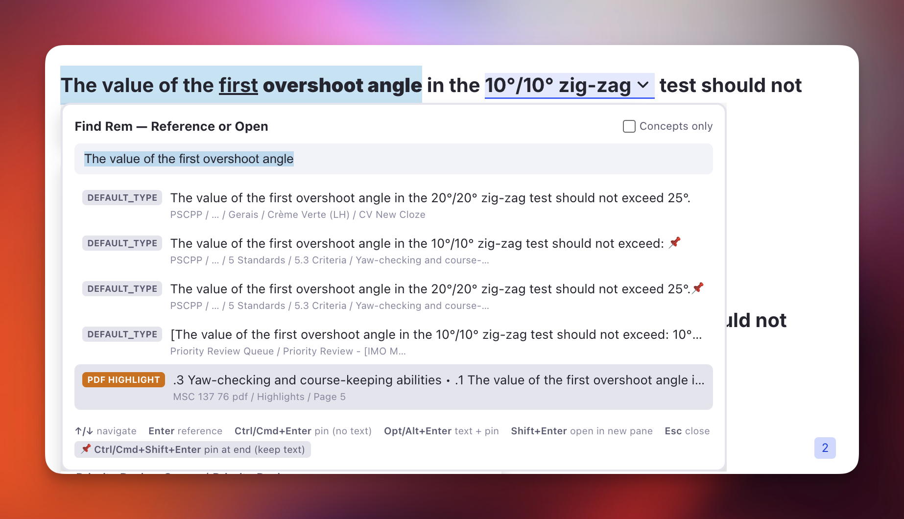
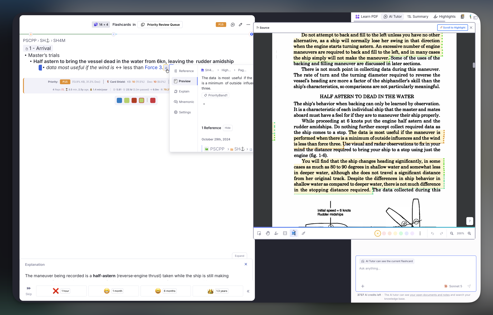
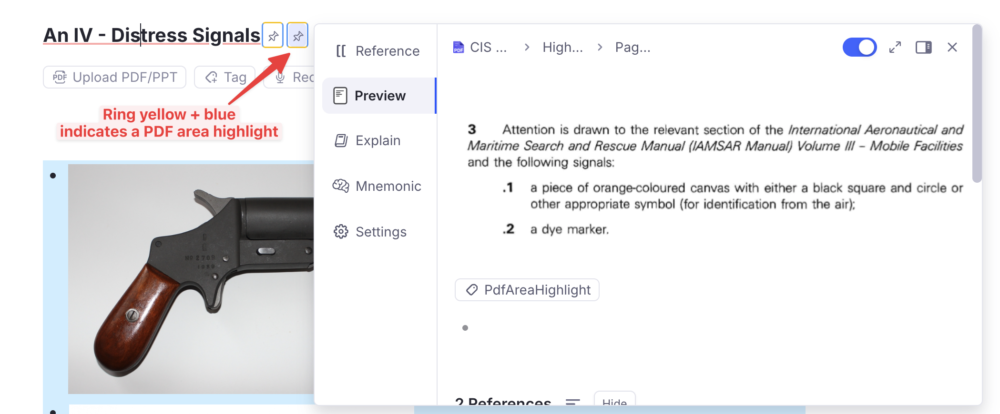

# Finding & Navigating

Reaching a Rem, a source, or a figure that RemNote's own search will not surface.

## Find Rem — Reference or Open

A floating picker that finds a Rem **by name even when RemNote's own reference search can't**, then either inserts a reference to it at your cursor or opens it in a new pane. Built for the frustrating case where a perfectly normal Rem — even a Concept referenced dozens of times — simply never appears when you type its name in the `[[` reference search.

### How to invoke

Run **`Find Rem (insert reference / open in pane)`** (quick code `fir`) or press **`Opt+Shift+F` / `Alt+Shift+F`**. A compact box opens **at your cursor**.

- **Type a name** → results appear as you type, with the best matches floated to the top (an `EXACT` badge marks an exact-name match; an `ALIAS` badge marks a match found through one of the Rem's [aliases](#find-by-alias)). Each row shows the Rem's **type badge** (see [Spotting PDF highlights](#spotting-pdf-highlights)), a 🖼️ icon when it holds an image (see [Spotting figures](#spotting-figures)), its **back text** (the definition side of a Concept↔definition card), and a short **breadcrumb** (`root / … / parent`) so you can tell which document it lives in when names collide.
- **Enter** or **click** → inserts a reference to the selected Rem at your cursor.
- **Ctrl+Enter / Cmd+Enter** or **Ctrl/Cmd+click** → inserts the reference as a **pin** (the link chip *without* the referenced text). See [Insert as a pin](#insert-as-a-pin) below.
- **Opt+Enter / Alt+Enter** or **Opt/Alt+click** → inserts the Rem's **text followed by a pin** — the readable text plus a link chip (RemNote's paste "Text with Pin"). See [Insert text with a pin](#insert-text-with-a-pin) below.
- **Shift+Enter** or **Shift+click** → opens the selected Rem in a **new pane** beside your current one (without inserting anything).
- **Ctrl/Cmd+Shift+Enter** or **Ctrl/Cmd+Shift+click** → appends a **pin at the end of the Rem you are editing, keeping your selected text**. See [Pin a source at the end of a Rem](#pin-a-source-at-the-end-of-a-rem) below.
- **↑/↓** navigate · **Esc** closes.
- **Concepts only** checkbox narrows results to Concept-type Rems.

The Rem you triggered the picker from is **excluded from results** — a Rem can't reference itself.

### Spotting PDF highlights

A PDF highlight carries the same `DEFAULT_TYPE` as any plain Rem, so the type badge alone couldn't tell a highlight apart from your own note of the same sentence — a common collision, since a note is often worded exactly like the passage it came from. Highlights are badged **`PDF HIGHLIGHT`** in amber instead, so you can see at a glance which result is the source passage and which is your note, and reference the one you meant.

### Spotting figures

A result whose Rem holds an **image** is marked with a 🖼️ before its name. An image contributes no searchable text, so a figure Rem is identified only by its caption — and captions are often near-identical to the prose that discusses them (`Figure 6.4: Definitions used on turning circle` beside a highlight reading *"… consists of (Fig. 6.4)"*). The icon tells you which row is the actual figure.

This reads the Rem's own text directly, so it is accurate whether or not you have ever run [Tag Rems With Images](#filter-a-document-by-images) — it does not depend on the **HasImage** tag being present or up to date.

### Why it finds Rems the normal search can't

RemNote's reference search builds its candidate list **per token, with a cap**. When *every* word in a Rem's name is high-frequency in your knowledge base (e.g. `Navegação Interior`, `mar territorial` — where both `navegação`/`interior` and `mar`/`territorial` appear in hundreds of Rems), the exact-name Concept never makes any token's candidate cut, so typing its full name returns a flood of partial matches but **not the Rem itself**. This is a property of the search ranking — not a corruption of the Rem — so "Reload Search Cache", retyping the name, or changing its type do **not** fix it. (You can confirm all of this on a specific Rem with the **[Search / Linkage Diagnostics](Troubleshooting.md#search-linkage-diagnostics-debug-widget)** tool in the Debug Widget.)

This picker sidesteps the limitation: it searches **each word of your query separately**, unions the results, keeps only the Rems whose name contains **all** your words, and floats exact-name matches to the top. Because a distinctive word (e.g. `interior`) *does* return the Rem, it reliably surfaces — then ranking puts the exact match first.

It also asks for the **whole query as a phrase**, which is the one thing that pulls back a small, precise set instead of a truncated flood. RemNote only looks for an exact run of adjacent words when the phrase it is handed is at least two words long, and it matches those words literally apart from the last one. That matters for names built from common words plus a number: a query like `fig. 6.4` seeds the word `fig`, which in a knowledge base full of figures returns thousands of Rems and is cut back long before yours is reached — whereas the phrase `figure 6.4` matches only the handful of Rems that actually contain those two words side by side. Since the literal spelling decides whether the phrase matches, both spellings are asked for (see [`Figure` = `Fig` = `Fig.`](#accent-insensitive-selection-aware)).

### Find by alias

Like RemNote's native `[[` search, this picker also matches a Rem by its **aliases** (the built-in **Aliases** powerup — the alternate names you add via *Edit or Add Alias*). Earlier versions only matched the Rem's *primary* name, so a Rem named **Via navegável** with an alias **vias navegáveis** would not appear when you typed the alias.

When a result's primary name doesn't contain every word you typed, the picker consults that Rem's aliases and matches against them too. An alias match is shown with the **alias text** as the row's title, an **`ALIAS`** badge, and the Rem's real name underneath (`↳ Via navegável`) so you know which Concept it links to.

Picking an alias match inserts a reference to the **owning Rem** that **renders the alias text** — exactly the shape RemNote uses for its own alias references (the reference's `aliasId` points at the matched alias). So inserting the **vias navegáveis** result links to the **Via navegável** Concept while displaying "vias navegáveis". Alias matches work with every insertion mode — normal reference, [pin](#insert-as-a-pin), and [cloze-aware](#cloze-aware-insertion) insertion.

### Recommended use cases

- **When RemNote's `[[` search won't find a Rem** you know exists (common-word names, heavily-referenced Concepts). Use `Opt+Shift+F` instead of `[[` to insert the reference.
- **To open an "invisible" Rem.** Shift+Enter / Shift+click jumps to the Rem in a new pane — the practical way to reach Rems the normal search buries.
- **To reference a Rem inside a cloze deletion** (see below).

### Insert as a pin

A **pin** is a Rem reference that renders as just the link chip **without** the referenced Rem's text. In native RemNote, creating one is fiddly: you insert the reference with `[[`, then right-click it → **Edit or Add Alias**, clear the text, and press Enter. This picker does it in **one keystroke** — press **Ctrl+Enter / Cmd+Enter** (or **Ctrl/Cmd+click** a result) instead of plain Enter, and the reference is inserted with `pin: true`.

Pins are cloze-aware and selection-aware just like normal references: inside a cloze the pin stays inside the cloze, and a pin can replace selected text.

### Insert text with a pin

Press **Opt+Enter / Alt+Enter** (or **Opt/Alt+click** a result) to insert the Rem's **text spelled out, followed by a pin** — the same result as RemNote's paste dialog option **"Text with Pin"**, but in one keystroke and without copying first. Use it when you want the reference to read as normal prose *and* carry a link back to the source — a flow that's handy when you're weaving a referenced Rem into a sentence.

It brings across the source's **full rich text**, not just a plain label:

- **Formatting and images are preserved** — bold, italic, inline colours, LaTeX, embedded images, and so on come along exactly as they appear in the source Rem.
- **Front/back cards bring the back too.** If the source is a Concept↔definition (or any front/back) card, the back text is included after the front, joined by a **practice-direction arrow** (`⇒`, `⇐`, or `⇔`) instead of RemNote's card delimiter.
- **The source's clozes are marked, not re-clozed.** Any cloze deletions in the source are inserted as **highlighted text (yellow background + reference-coloured font)** — the same visual mark the plugin's cloze command (`Opt+Z`) leaves behind — so they still *read* as clozes without becoming functional clozes in your target (no "clozes out of clozes").

Alias matches use the alias Rem's text; the trailing pin still links to the owning Rem.

### Pin a source at the end of a Rem

The other three modes all insert **at your cursor**, and — like RemNote's own `[[` — a text selection is **consumed**: the words you highlighted are replaced by the reference. That is wrong for one very common move: *linking a flashcard back to where it came from*. There, the selected text is the card, and the reference belongs at the **end** of the line, out of the way.

Press **Ctrl/Cmd+Shift+Enter** (or **Ctrl/Cmd+Shift+click** a result) to do exactly that: a **pin is appended at the end of the Rem**, and your **selected text is left untouched**. The pin lands at the end of the field the selection is in, so highlighting something on a card's back appends to the back, not the front. When the selection sits inside a cloze, the pin stays *outside* it — a pin at the end of the line is a source marker, not part of the answer.

**The queue flow this is built for.** You are reviewing a card and want to check where it came from — say the PDF highlight behind it:

1. **Peek at the source** while the card is in front of you.
2. **Select part of the card's text** — the phrase you would search for.
3. Press **`Alt+Shift+F`**. The picker opens with that text already in the search box, so the source Rem (its `PDF HIGHLIGHT` badge makes it easy to spot — see [Spotting PDF highlights](#spotting-pdf-highlights)) is usually the first result.
4. Press **`Ctrl/Cmd+Shift+Enter`**.

The card keeps reading exactly as before, and now carries a small chip at the end that takes you straight back to the highlight next time the card comes up — no re-searching, no broken wording.

### Cloze-aware insertion

Both RemNote's native `[[` and this picker would normally **break a cloze deletion** if you inserted a reference inside it — the new reference would land *outside* the cloze. This picker is **cloze-aware**: when your cursor (or selected text) sits inside a cloze, the inserted reference is stamped with that cloze's id, so it stays **inside** the cloze instead of splitting it.

### Accent-insensitive & selection-aware

- **Accent/diacritic-insensitive:** typing `navegacao interior` matches `Navegação Interior`.
- **`Figure` = `Fig` = `Fig.`:** figure abbreviations are treated interchangeably, so typing `fig 4.3` lists a Rem named `Figure 4.3`, and typing `figure 4.3` finds one named `Fig. 4.3` or `Fig 4.3`. Any capitalisation works and the trailing dot is optional. It's folded the same way accents are — the standalone word `fig`/`fig.` is canonicalised to `figure` in both your query and each Rem's name (and alias) before matching, so an exact match still ranks first with its `EXACT` badge. Only the whole word is affected: `figs`, `configure`, etc. are left alone. The **search itself** is run in both spellings too, not just the matching: `fig. 6.4` is looked up as `fig. 6.4` *and* as `figure 6.4`, because RemNote's phrase lookup matches the words literally and would otherwise never return `Figure 6.4: …` for a query written `Fig.` (see [Why it finds Rems the normal search can't](#why-it-finds-rems-the-normal-search-cant)).
- **Selected text seeds the search:** if you select text before invoking, the box opens pre-filled with it (and selected, so you can refine or overwrite). On insert, the selected text is **replaced** by the reference — exactly like RemNote's `[[` behaviour where selected text becomes the link.

> The reference is inserted into the editor that was focused when you opened the picker. In the rare case RemNote has no active editor caret at insertion time, the picker copies the reference to your clipboard instead and tells you to paste it.

### Stays on-screen near the edges

The picker opens **at your cursor**, but it now keeps itself fully visible instead of being clipped by the window edge:

- **Near the right edge** it flips to open to the **left** of the cursor.
- **Past the vertical midpoint** it flips to open **above** the cursor (like RemNote's own selection search), and the results list is capped to the space available on whichever side it opens, so a long list **scrolls** rather than running off-screen.

This all happens before the box appears, so you never see it jump.

---

## Open Source in Popup

Opens the **PDF or web article behind a reference pin** *without leaving the queue*. Built for the moment in review when a flashcard (or any Rem) carries a pin to a PDF highlight and you want to glance at the surrounding source — clicking the pin directly **navigates away and tears down the queue** (you lose your position and the ability to rate the card). This shows the source on top of (or beside) the queue instead, so you read it and dismiss it without interrupting the session.

It comes in **two variants** — a centered **modal popup** and a non-blocking **floating window** — that share the same reader; pick whichever fits the moment.

{ width="900" }

### Two ways to open it

Both are triggered the same way — **hover** the reference pin, then press a shortcut — and both only act on genuine **Reader sources** (see [What it opens](#what-it-opens)).

| | **Modal popup** | **Floating window** |
| --- | --- | --- |
| Command | `Open Hovered Source in Popup` | `Open Hovered Source in Floating Window` |
| Shortcut | **`Opt+O` / `Alt+O`** | **`Opt+Shift+O` / `Alt+Shift+O`** |
| Placement | Centered, large | Right portion of the screen (≈48% width) |
| Blocks the UI behind it | **Yes** — a backdrop covers/dims the card | **No** — the card/editor stays visible beside it |
| Best for | "Open → read → close → rate" in one focused glance | **Peeking back and forth** between source and card without close/reopen |
| Closes on | `✕`, Esc, or clicking outside | `✕`, Esc, or advancing to the next card (does **not** close on outside click, so you can highlight/select in the PDF) |

**Why hover + a shortcut, instead of right-click?** RemNote exposes a *hover* event for references to plugins but **no right-click/context-menu event**, and the plain left-click navigation can't be intercepted. So the queue-safe path is: hover to identify the reference, then a shortcut you own to open it. The plugin tracks only the last-hovered reference and resolves it when you press the key.

### How to invoke

1. **Hover** the reference pin (the link chip) you want to open. *Hovering* is the signal the plugin listens to — no click needed.
2. With the pin still hovered, press **`Opt+O`** for the modal popup, or **`Opt+Shift+O`** for the floating window.
3. The source renders inside RemNote's own PDF/web reader. The queue stays live; close it to return exactly where you were.

### What it opens

The command inspects the hovered reference's target and only acts on **Reader sources** (identical for both variants):

| Hovered reference points to… | Behavior |
| --- | --- |
| **PDF highlight** | Opens the host PDF and auto-scrolls to the highlight |
| **HTML / web-article highlight** | Opens the article (Reader Mode) at the highlight |
| **PDF source document** (the uploaded file Rem) | Opens the PDF at the top |
| **HTML source** (a non-YouTube Link Rem) | Opens the article |
| **A plain Rem** (no PDF/HTML source) | **Nothing happens** — you get a toast and default behavior is left untouched |

So you can hover *any* pin and press the shortcut safely; only genuine sources open a viewer.

### Scroll to Highlight

For PDF/HTML **highlights**, the viewer auto-scrolls to the highlighted passage once the reader finishes mounting (the embedded PDF engine takes a few seconds to initialize, so the scroll is retried a few times). If you then scroll around the document and want to jump back, click the **🔖 Scroll to Highlight** button in the header to re-center on the highlight at any time.

### Floating window — interaction & closing

The floating variant is designed so the source sits **beside** your card while you study, which is why it behaves a little differently from the modal:

- **Stays open while you use the PDF.** Unlike a modal, clicking into the reader to highlight, select text, or click existing highlights will **not** dismiss it.
- **Closes itself when you advance the card,** so a previous card's source never lingers over the next one.
- **Esc closes it** — without closing the queue. The plugin "steals" the Esc key while the float is open, so RemNote's queue doesn't act on it; Esc closes the float instead. (When focus is inside the PDF itself, the browser handles Esc within the reader; use the `✕` button there.)
- **Not user-resizable.** RemNote floating widgets have a fixed registered size; the window opens at ≈48% of the screen width on the right.

{ width="900" }

### Recommended use cases

- **Mid-review context check.** While rating a flashcard that references a PDF highlight, open the source to re-read the paragraph it came from — then close and rate, without losing your queue position. *(Modal is ideal for a quick look; floating if you need to glance repeatedly.)*
- **"What was I trying to recall?"** Keep the **floating** window open beside the card so you can look from the source back to the card and forth, without the close/reopen churn a modal forces.
- **Reviewing extracts and clozes** that carry a [bridging pin back to the original PDF source](Create-Incremental-Rem-from-PDF-Highlights.md) — see the figure or surrounding text without navigating into the document.
- **Any pin to a long source** where the inline hover-preview is too small but opening the full document in a pane is too disruptive.

> Implemented as the Source Popup widgets — [modal](Plugin-Widgets-Reference.md#65-source-popup-modal-queue-safe-pdfhtml-viewer) and [floating](Plugin-Widgets-Reference.md#66-source-popup-floating-non-blocking) — triggered by the **Open Hovered Source in Popup / Floating Window** commands. The default shortcuts `Opt+O` and `Opt+Shift+O` can be rebound in RemNote's keyboard settings.

---

## Filter a Document by Images

RemNote's search indexes **text**. An image carries no searchable token, so neither `Ctrl+F`, nor the query language, nor a Search Portal can answer *"show me the figures in this chapter"* — the **Filters** section of RemNote's document search only lists **tags**, and an image is not one.

**Tag Rems With Images** (`quick: img`) closes that gap. It scans a scope for images and marks every Rem holding one with the **`HasImage`** tag — which the native document filter *can* isolate.

### How to use it

1. Put your cursor in the Rem you want to scan — or simply open the document — and run **Tag Rems With Images** from the Omnibar (`Cmd+/`).
2. The **Image Scan popup** opens with two scopes to choose from:
    - **Scan this Rem and its descendants** — the button **names the exact Rem**, so you can be sure of the target before anything is written. The scope is the **focused Rem** when your cursor is in one, and the **open document** otherwise. (With neither, this button is disabled.)
    - **Scan the whole knowledge base** — every Rem, every document. The **first** such run is slow in proportion to how many images it finds ([how long it takes](#how-long-it-takes-the-first-whole-kb-run-is-slow)), so reach for it when you want the tag applied everywhere once, and use the scoped run for day-to-day work.

    The popup is **fully keyboard-driven**: `↑`/`↓` move between the two scopes, `Enter` runs the selected one, `Esc` cancels. (`Esc` is ignored *while a scan is running*, so a reflex press can't abort a long run.)

    { width="700" }

3. Progress is reported live while it runs. **Keep the popup open until it finishes** — the scan runs inside it, so closing it stops the walk. Nothing is corrupted if you do: whatever was already tagged stays correct, and running the command again picks the work up.
4. When it finishes, the **same popup reports the work done** — Rems scanned, how many hold an image, how many were newly tagged, how many had the tag cleared — and repeats the two ways to use it. **Scan again** goes back to the scope choice; **?** in the header opens this page.

### Seeing the result

**Filter one document.** Open it, press **`Cmd/Ctrl+Shift+F`** (or `Cmd/Ctrl+F` and switch the search mode to **Filter**), then pick **HasImage**. The document collapses to just the Rems that carry an image. The count next to each filter tells you how many Rems it would leave — `3 · ⚡ HasImage` below.

{ width="700" }

**Collect them anywhere.** A **Search Portal** on the `HasImage` tag gathers every tagged Rem into one place — useful for building a figure index across documents, and combinable with another tag or a document in the query to narrow it down. This is the whole-KB scan's payoff: with the tag applied everywhere, one portal is a live index of every image in the knowledge base.

### What counts as an image

Any image element in a Rem's **front text or back text** — pasted, dragged, added with `/image`, or extracted from a PDF. Image-occlusion Rems count too, since the occlusion is drawn on an ordinary image element. An image sitting only on the **back of a flashcard** is found, which a purely visual scan of the outline would miss.

### Re-running it

The command is **idempotent and self-correcting**. On every run it also *removes* the tag from Rems inside the scope that carry it but no longer hold an image — so deleting a figure and re-running leaves no stale mark behind. Rems **outside** the scanned scope are never touched, so a scoped run cannot disturb tags applied in other documents (only a whole-KB run reaches them).

Only Rems whose state actually changes are written to, which is what makes a re-scan of a large document cheap.

### How long it takes — the first whole-KB run is slow

**Finding the images is fast. Applying the tags is not.** Reading every Rem in a large knowledge base takes seconds; writing a tag costs a round trip to RemNote, and those happen one at a time. So the cost of a run is set almost entirely by **how many tags it has to write**, not by how many Rems it looks at.

Measured on a knowledge base of **413,000 Rems** holding **23,000 images**:

| Run | Writes | Time |
| --- | --- | --- |
| Reading every Rem, before any tagging | — | **~10 seconds** |
| First whole-KB run, tagging everything it finds | 23,000 | **~30 minutes** |
| Every whole-KB run after that | ~0 | **~10 seconds** |
| One document (12,000 Rems, 1,200 images) | 1,200 | **~90 seconds** |

So the whole-KB scan is a **one-time cost**, and only on a knowledge base of that size — the write cost per tag also grows with the knowledge base, so a smaller one is disproportionately quicker. After the first pass there is nothing left to write, and a re-scan only has to write the handful of Rems whose images changed since. Day-to-day, run it on a document and it finishes while you watch.

If you would rather not sit through the first pass, run it **per document as you go**; the tag accumulates, and a whole-KB run afterwards finds most of the work already done.

!!! tip "Leave it running"
    The scan lives inside the popup, so keep it open. If you do close it, nothing breaks — the tags already written stay correct, and running the command again picks up where it left off.

### Clearing the tag

**Remove `HasImage` Tags** (`quick: rmimg`) takes the tag **off** every Rem that carries it, in the focused Rem's subtree or across the whole knowledge base. It exists because a whole-KB scan can mark tens of thousands of Rems and RemNote offers no way to take a tag off in bulk.

**Nothing is lost.** The tag is derived from the images themselves, so **Tag Rems With Images** rebuilds it exactly — the same relationship *Remove All Priority Band Tags* has to *Refresh Priority Badges*. That is why there is no undo: re-running the scan *is* the undo.

The scopes and keys match the scan's, and it costs the same per tag — clearing 23,000 tags takes about as long as applying them, so prefer the document scope unless you really do want the tag gone everywhere.

### The tag is invisible in the outline

`HasImage` is bookkeeping for the filter, not something to read. Its chip is hidden from the editor tag bar — precisely, by targeting that pill alone, so **your own tags on the same Rem stay visible**. You will still see `HasImage` where it matters: in the document's Filter list.

### Pins that lead to an image are ringed

A **pin** is drawn with a hairline ring saying where it leads, so you can pick the right one without following any of them — useful in an extract, where the plugin leaves both a reference to the parent it came from *and* a pin to the PDF highlight:

| Ring | The pin leads to |
|------|------------------|
| **Blue** | a Rem holding an **image** — a figure in your own notes |
| **Yellow** | a **text highlight** in a PDF or web article — the source passage |
| **Yellow + blue** | a **PDF area highlight** — a clipped figure from the source |
| none | an ordinary Rem |

Yellow means *"this leads into a source document"* and blue means *"you will land on an image"*, so an area highlight — which is both — carries both colours, one per edge. The rings brighten when you hover one or edit the Rem.

{ width="900" }

> **Off by default.** Turn on **Enable Pin Reference Colour Rings** (Plugin Settings → *Editor Indicators*) to get them. Two of the three states depend on tags this scan writes, so the feature is opt-in rather than something a knowledge base wakes up wearing. With the setting off, pins are left completely unmarked — including the priority-band border the highlight styling would otherwise draw on them. Every colour the plugin uses is catalogued in the [Colour Coding Reference](Colour-Coding-Reference.md).

This is the second thing the [image scan](#filter-a-document-by-images) buys you, and it needs the scan to have run: the ring keys on the tag, so it appears on a pin only once its target has been tagged, and disappears when a re-scan clears the tag from a Rem whose image is gone.

{ width="800" }

The pin next to it in that screenshot shows the two markers are independent: the **orange dotted box** is the [priority band](Prioritization-&-Sorting.md) of the linked highlight, the **blue ring** is "leads to an image". A pin can carry both.

**The ring shares its box with the priority band.** Pins to highlights also carry the [priority band](Prioritization-&-Sorting.md) marker of the linked highlight, which sets the **bottom and right** edges. Rather than avoid that, the ring takes the **top and left** — so an extracted highlight's pin shows one box, half band colour and half ring colour, instead of two nested ones. On an area highlight the top edge is yellow and the left is blue for exactly this reason: those are the two edges that survive when a band is present. All three rings are **solid**, keeping them clear of the band marker's dotted and dashed vocabulary.

The blue ring is drawn in RemNote's **accent** colour — the same one the app uses for links and selection, which reads correctly on something that *is* a navigation target. It was neutral grey at first, on the theory that hue is already spoken for in this plugin ([priority bands](Prioritization-&-Sorting.md) own the red→green ramp, `#pdfextract` is blue, `#incremental` green); in practice a grey hairline around an 18px icon in running text was invisible until hovered, which is no marker at all. The accent can't be confused with any of those, because this ring is an **outline on an icon** — never a background fill, never a left border — and it appears on nothing but pins. There is no fill either, so a pin sitting inside a highlighted extract never paints over the highlight's own colour, and both colours come from RemNote's own border tokens, so the ring follows light and dark mode.

**Why an area highlight is worth its own state.** When you clip a *region* of a PDF instead of selecting its text, RemNote stores the **image** on the highlight Rem in place of the text — an **area highlight**. It is a highlight *and* an image, which is why it wears both colours rather than a third one of its own.

What identifies one is that the Rem holds an image **and nothing else** — no caption, no prose. That matters, because *adding* a figure to an ordinary text highlight is common, and such a Rem holds an image and is a highlight, yet is not an area highlight; it keeps the blue ring. The scan decides this and records it as **`PdfAreaHighlight`**, since "image and nothing else" is a property of the Rem's text that no filter or stylesheet can inspect on its own.

{ width="800" }

**The two tags are mutually exclusive.** An area highlight carries `PdfAreaHighlight` and *not* `HasImage`; every other Rem holding an image carries `HasImage`. Tagging area highlights with both would make `HasImage` a complete list of every figure, which is tidier to filter — but RemNote collapses two or more tags into a **"N tags" chip** that no rule can hide without also hiding your own tags, and that clutter is not worth a filter you would rarely run on a highlights document. So: filter `HasImage` for figures in your notes, `PdfAreaHighlight` for clippings from a source. `PdfAreaHighlight`'s chip is hidden from the tag bar exactly like `HasImage`'s.

Two consequences worth knowing: caption an area highlight and the next scan swaps its tags — `PdfAreaHighlight` off, `HasImage` on — and the ring turns blue; and a Rem holding only an image that did **not** come from a PDF, a figure pasted into your own notes, gets `HasImage` and stays blue, since the yellow means "this leads into the source document".

> **Only image pins.** Pins to ordinary Rems are left alone. Ringing *every* pin was tried and says nothing — a marker that appears on all of them carries no information.
