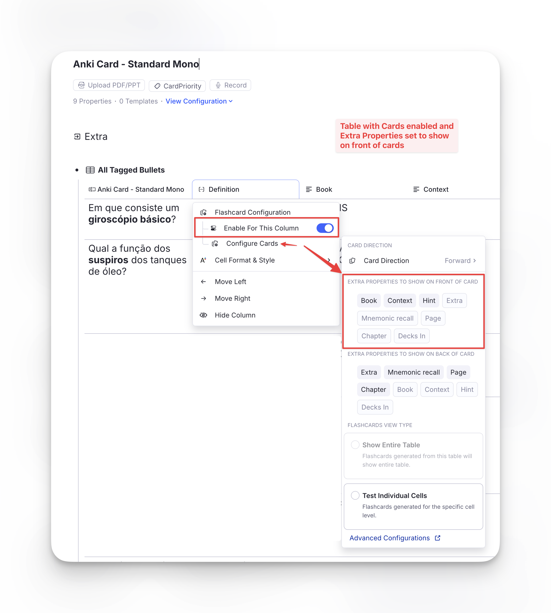
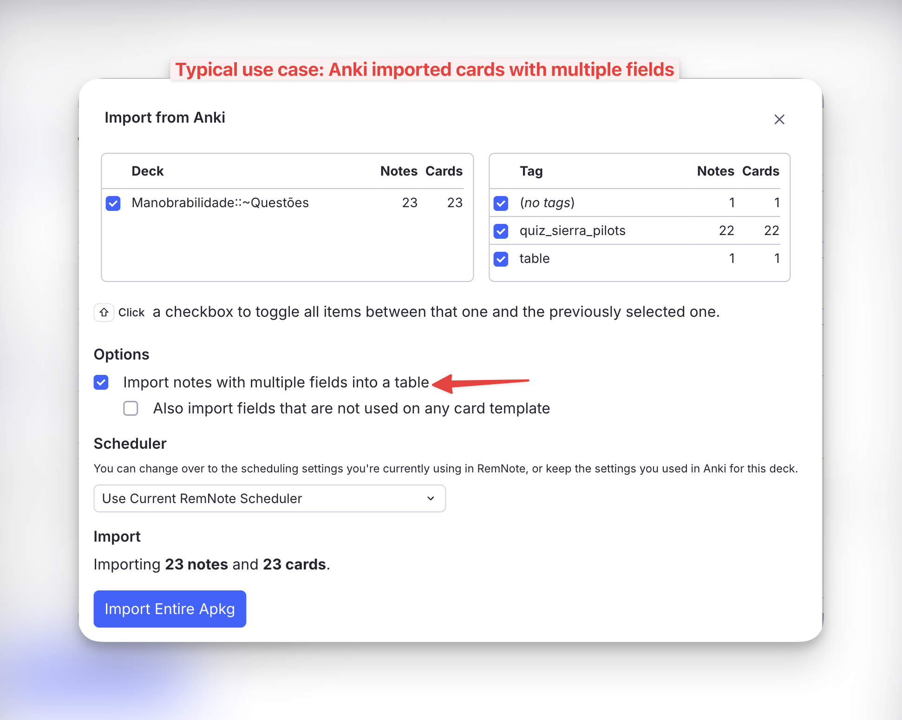
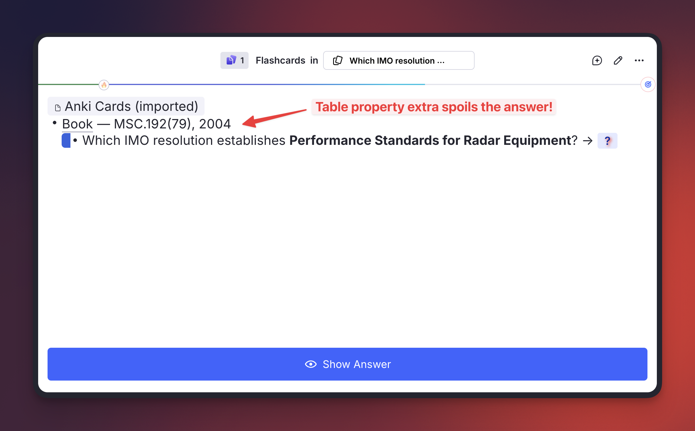
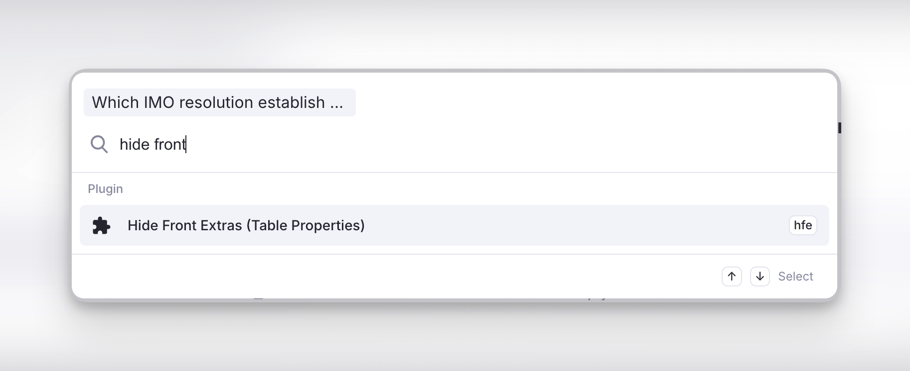
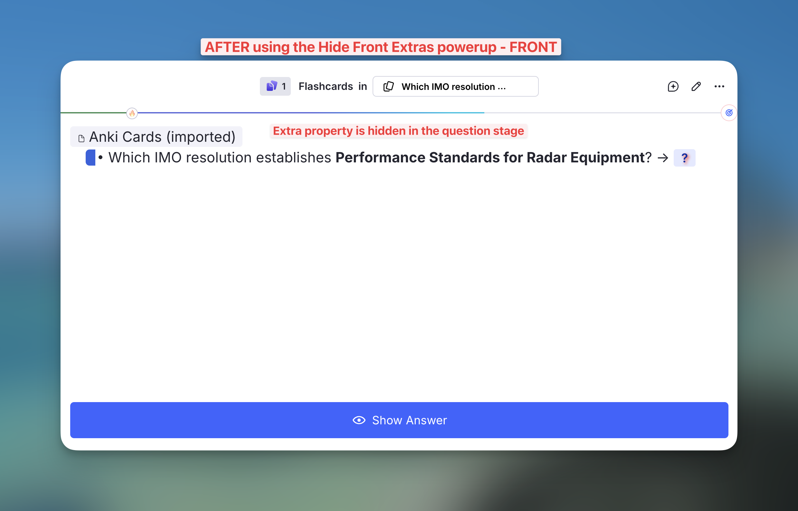
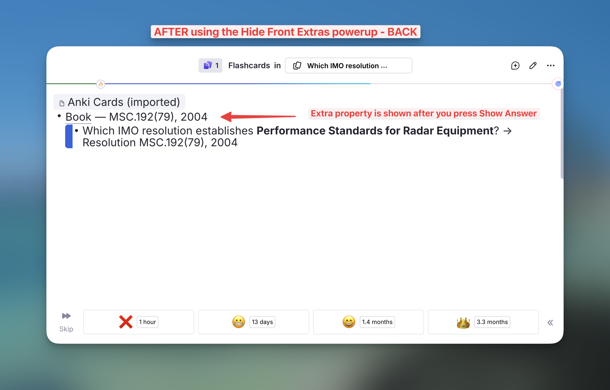

# Queue Display Utilities

A collection of powerups and commands incorporated into Incremental RemNote (originally from the standalone **Hide in Queue** plugin), plus three new powerups — **Remove Parent**, **Remove Grandparent** and **Hide Front Extras** — that improve how parent/ancestor Rems and card details are rendered during queue review.

---

## Activation

The 5 powerups originally from the Hide in Queue plugin (Hide in Queue, Remove from Queue, No Hierarchy, Hide Parent, Hide Grandparent) are gated by the **Enable Hide-in-Queue powerups and commands** setting in Plugin Settings.

> ⚠️ **Important.** Only enable this setting if you do **NOT** have the standalone Hide in Queue plugin installed. The powerup codes are identical, and RemNote throws a fatal `Duplicated powerup` error if both plugins try to register the same code — Incremental RemNote will fail to load. If you currently use the standalone plugin, uninstall it first, then enable the setting and reload RemNote.

The three new powerups — **Remove Parent**, **Remove Grandparent** and **Hide Front Extras** — are always registered regardless of the setting. They have no equivalent in the standalone plugin, so they cannot collide with it; and the [Cloze](IR-Flow--Reading-Extracting-and-Clozing.md) and [Extract](IR-Flow--Reading-Extracting-and-Clozing.md) creators apply Remove Parent automatically to newly-created Rems.

---

## Hide in Queue (`hiq`) { #hide-in-queue }

Tag any Rem with **Hide in Queue** (using the command). Its content will be replaced on the front of descendant flashcards with "Hidden in queue":

* The content of the tagged Rem is hidden, but *the bullet point itself remains visible*.
* Instead of the text, a ghosted/faded label saying **"Hidden in queue"** appears next to the bullet.
* **Visual result:** The user still sees the structural indentation and knows that something is there, but the actual information is obscured during the question phase. Good for hiding hints, spoilers, or context that would make retrieving the answer trivial.

**Editor:**

**Queue:**

### Create Extract — Source Rem Hiding Behavior

When you create an Extract (`Alt+Shift+X`), the source Rem is automatically tagged so it doesn't show up redundantly during review of the extract. The plugin picks one of two strategies depending on what's available:

- **Preferred path — Remove from Queue on the source.** If the Remove from Queue powerup is registered (either via the **Enable Hide-in-Queue powerups and commands** setting above or via the standalone Hide in Queue plugin), it's applied directly to the source Rem. This survives extract relocation cleanly: if you later delete the source and let extracts stand on their own, the powerup goes with the source.
- **Fallback path — Remove Parent on the extract.** If Remove from Queue isn't registered (neither integration enabled nor standalone plugin installed), Remove Parent is applied to the *extract* instead. This works for normal review, but has a caveat: if you later move the extract under a different parent, that new parent will also be hidden. To recover, remove the powerup manually from the extract — or enable the Hide-in-Queue integration so future extracts land in the preferred path.

The cloze creator (`Alt+Z`) does **not** branch like this — it always applies Remove Parent to the newly-created cloze Rem, because clozes are tightly bound to their source via the pinned reference and aren't typically relocated independently.

---

## Remove from Queue (`rfq`)

Tag any Rem with **Remove from Queue** (using the command). Its content will be completely removed from the flashcard's visual hierarchy of its descendants.

* Not only is the text gone, but any child Rems underneath it are pulled to the left, essentially collapsing the space.
* **Visual result:** It looks exactly as if that intermediate Rem never existed in your document hierarchy at all.

**Editor:**

**Queue:**

### Hide in Queue vs. Remove from Queue

- **Hide in Queue (`hiq`):** content is hidden, but the bullet point structure remains visible with a "Hidden in queue" ghosted label. Use when you want to acknowledge the structural presence of a parent but obscure its text.
- **Remove from Queue (`rfq`):** the Rem is completely removed from the visual hierarchy (`display: none`), and any children are shifted left to fill its space. Use to erase an intermediate parent level entirely as if it never existed.

---

## No Hierarchy (`nh`)

Tag any Rem with **No Hierarchy** (using the command). Any ancestors will be hidden on the front and back of the flashcard.

**Editor:**

**Queue:**

---

## Hide Parent (`hp`)

Tag any Rem with **Hide Parent** (using the command `Hide Parent` or `/hp`). Its immediate parent will be hidden on the front of the flashcard, but revealed on the back.

Similar to **Hide in Queue**, but instead of tagging the parent Rem, the user tags the specific flashcard Rem — so other flashcard descendants of the same parent Rem are *not* affected.

**Editor:**

**Queue:**

---

## Hide Grandparent (`hgp`)

Tag any Rem with **Hide Grandparent** (using the command `Hide Grandparent` or `/hgp`). Its grandparent will be hidden on the front of the flashcard, but revealed on the back.

**Editor:**

**Queue:**

---

## Remove Parent (`rp`) — New

Like **Hide Parent**, but more aggressive: the immediate parent is **completely removed** from the queue display on **both the front and back** of the card — no "Hidden in queue" placeholder, no indented blank space.

The cloze creator (`Alt+Z`) applies this powerup automatically to the newly-created cloze Rem, so the source Rem isn't shown redundantly during review **without** also affecting other descendant flashcards (e.g. Descriptor children) that need the parent visible for context.

The extract creator (`Alt+Shift+X`) uses Remove Parent only as a **fallback**, when the **Remove from Queue** powerup isn't available. See [Create Extract behavior](#create-extract-source-rem-hiding-behavior) for the full rule.

You can also apply Remove Parent manually to any flashcard via the **Remove Parent** command or `/rp`.

---

## Remove Grandparent (`rgp`) — New

Same as Remove Parent, but one level higher: the grandparent is fully removed from the queue display on both front and back of the card.

Apply via the **Remove Grandparent** command or `/rgp`.

---

## Hide Front Extras (`hfe`) — New { #hide-front-extras }

Hides the **table properties displayed on the front** of the tagged flashcard. They still appear on the back.

### Where "front extras" come from

There is only one way a RemNote card ends up with extra content on its question side: a **table** whose column has **flashcard generation enabled**, configured with **Extra Properties to Show on Front of Card**. Those properties are then printed above the question of *every* card that column generates — one row's worth per card.

The setting lives in the column's ⋮ menu → **Flashcard Configuration → Configure Cards**. In the screenshot, the *Definition* column (how RemNote shows the backside of the rem in tables) generates the cards, and **Book**, **Context** and **Hint** were chosen to show on the front (with *Extra*, *Mnemonic recall*, *Page* and *Chapter* on the back).

By far the most common way to end up with such a table is the **Anki importer** with **"Import notes with multiple fields into a table"** enabled: each Anki field becomes a column, and the context fields (Book, Source, Chapter, Hint…) are naturally mapped to the front of the card.

### The problem it solves

The front-extras setting is made **per column**, so it applies to every row alike. That is usually what you want — until one row's property happens to *be* the answer:

Here the *Book* property, shown for context, prints `MSC.192(79), 2004` right above a question asking **which** IMO resolution that is. Turning the setting off on the column would strip the useful context from all the other rows.

### Applying it

Tag the **flashcard Rem itself** (the table row) — from the queue or the editor, via the **Hide Front Extras (Table Properties)** command, `/hfe`, or the tag menu:

Only that card is affected. Every other card from the same table keeps showing its front properties.

### Result

The properties are gone from the question stage…

…and come back when you press **Show Answer**, so you keep the context while grading:

> **Why No Hierarchy doesn't do this.** Front extras are not ancestors. They render as their own block beside the question, so [No Hierarchy](#no-hierarchy-nh) — which hides the content of the ancestor Rems — leaves them fully visible. The two powerups are complementary and can be applied to the same card.

---

## Queue Support

All commands above can be triggered directly while reviewing a flashcard in the Queue, without needing to switch to the editor:

- **No Hierarchy, Hide Parent, Hide Grandparent, Remove Parent, Remove Grandparent, Hide Front Extras:** automatically apply the powerup directly to the current card.
- **Hide in Queue and Remove from Queue:** since these are designed to be applied to *parent/ancestor* Rems rather than the flashcard itself (applying them to the current card would make the card vanish), triggering them in the queue opens a confirmation prompt offering to apply the powerup to the card's parent instead.
